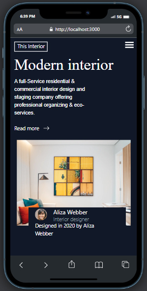

# Modern Interior Web Page with Next.js

Welcome to the Modern Interior Web Page project! This project showcases a beautifully designed and responsive website for a modern interior design agency. The website features elegant layouts, stunning visuals, and smooth interactions to provide an immersive experience.



## Table of Contents

- [Demo](#demo)
- [Features](#features)
- [Getting Started](#getting-started)
- [Usage](#usage)
- [Technologies Used](#technologies-used)
- [Contributing](#contributing)
- [License](#license)

## Demo

You can explore a live demo of the Modern Interior Web Page [here](https://interior-9sb1uat83-ajewoleolugbenga.vercel.app/).

## Features

- Clean and modern design that showcases interior design projects effectively.
- Fully responsive layout that looks great on all devices and screen sizes.
- Smooth animations and transitions for a seamless browsing experience.
- Engaging photo galleries and interactive sliders to display project images.
- Elegant typography and color scheme that complement the interior design theme.

## Getting Started

To set up this project locally, follow these steps:

1. **Clone the repository:**

   ```bash
   git clone https://github.com/ajewoleOlugbenga/interior-consultant.git
